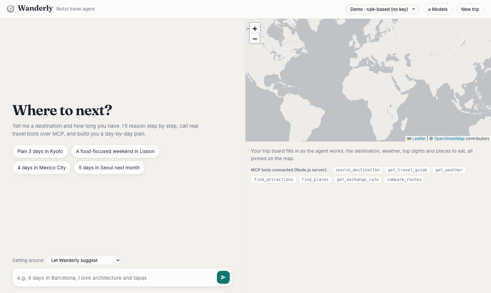
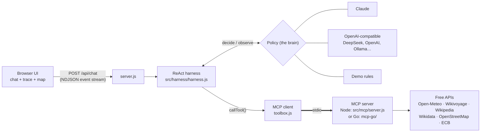

# 🧭 Wanderly - AI Travel Agent

Tell it *"3 days in LA"* and watch it reason step by step, call real travel APIs through an **MCP server**, and build a day-by-day itinerary with a live map, weather, top sights and places to eat.

<p align="center">
  
  <br><sub>Planning 3 days in LA. This recording uses the no-key <b>Demo mode</b>, where a rule-based policy stands in for the LLM so anyone can run the app. Add a Claude, DeepSeek or other OpenAI-compatible API key and the same ReAct loop is driven by the model, which decides which tools to call and writes the itinerary.</sub>
</p>

- **ReAct architecture**: the agent loops *Thought → Action → Observation* until it can give a *Final Answer*, and the UI shows every step live.
- **MCP tool server, in Node.js or Go**: seven travel tools behind the [Model Context Protocol](https://modelcontextprotocol.io), with two interchangeable implementations of the same server. The web app uses them over MCP, and so can Claude Desktop or Claude Code.
- **Pluggable brain**: Claude, DeepSeek, OpenAI, Groq, OpenRouter, a local Ollama… Add a model from the UI by typing its API key, or run the no-key **Demo** policy.
- **Production-style harness**: step limits, per-tool timeouts, retries with backoff, cancellation, caching, output truncation, JSONL traces, unit tests and an eval suite.
- **Getting around**: each day ends with a transport recommendation (walk, bike, drive or transit, with real bus/metro/train lines). Set your preference in the chat box, or the agent asks you when it matters (for example a multi-city trip).
- **Replies in your language**: ask in Chinese, Spanish or anything else and the plan comes back in that language.
- **Short-term memory and chat history**: the agent remembers the conversation (even when you switch models), and a page refresh restores the chat, map and trip board. Everything is forgotten when you close the tab.
- **Free data, no keys**: Open-Meteo, Wikivoyage/Wikipedia, Wikidata, OpenStreetMap and ECB exchange rates.

---

## Quick start

Requires **Node.js 22.9+**. Go 1.25+ is optional, needed only for the Go MCP server.

```bash
git clone https://github.com/axlezhao/Wanderly-AI-Travel-Agent.git
cd Wanderly-AI-Travel-Agent
npm install
npm start
```

Open **http://localhost:3000**. With no API key it runs in **Demo** mode: a rule-based policy that uses the same harness and tools.

To use a real LLM, either:

- **In the UI:** click **⚙ Models** → pick a preset (DeepSeek, Anthropic, OpenAI…) → paste your API key → **Discover models** → **Test connection** → **Save model**.
- **Or in `.env`:** `cp .env.example .env` and fill in `ANTHROPIC_API_KEY` and/or `DEEPSEEK_API_KEY`, then restart.

Keys stay on your computer (`.env` and `models.local.json` are git-ignored) and are never sent to the browser.

---

## How it works



### ReAct in one paragraph

**ReAct** (*Reason + Act*) is an agent pattern. Instead of answering in one shot, the model alternates between **Thought** ("I need Los Angeles' coordinates first"), **Action** (call `search_destination`), and **Observation** (the tool's result), repeating until it has enough to write the **Answer**. Independent actions in one step run in parallel. In this app:

| ReAct | Claude | OpenAI-compatible | UI |
|---|---|---|---|
| Thought | text before `tool_use` blocks | `content` next to `tool_calls` | "THOUGHT" line |
| Action | `tool_use` blocks | `tool_calls` | tool row with spinner |
| Observation | `tool_result` blocks | `role: "tool"` messages | ✅ + summary |
| Answer | response with no tool calls | message with no tool calls | the itinerary |

### The harness

The model only decides *what to do next*. [`src/harness/harness.js`](src/harness/harness.js) owns everything around it, and gives every policy the same guarantees:

| Guarantee | Why |
|---|---|
| **Step limit** (`MAX_STEPS`, default 6), last step forces an answer | no infinite loops; you always get *something* |
| **Parallel actions** within a step | weather + sights + restaurants at once |
| **Per-tool timeout** (60 s); every failed lookup is **tried a second time** (temporary errors like 429/5xx/timeouts up to 3 times) | free public APIs are flaky |
| **LLM fallback**: if a lookup still fails, the model fills that part from its own knowledge, labeled "(general knowledge, not live data)" | you still get a complete plan, and you know what isn't live data |
| **Circuit breaker**: a tool that fails twice in one request is skipped after that | no waiting on a service that's down |
| **Model retries** for every provider: a model request that fails for a temporary reason (429, 5xx, overloaded, network drop, cut-off stream) is re-sent up to 2 more times with backoff, honoring `Retry-After`; bad keys or bad requests fail immediately | a busy model API doesn't kill your trip plan |
| **Real cancellation**: Stop button → HTTP request → harness → MCP `cancelled` → `fetch` aborted | no zombie requests hogging rate limits |
| **Caching**: per-session in the harness, 15 min shared in the MCP server | fewer API calls, instant repeats |
| **Observation truncation** (12k chars) | one huge result can't flood the context |
| **Errors become observations** | the model sees "not found" and changes approach |
| **Structured events + JSONL traces** in `traces/` | watch it live, debug it later |

A policy is anything with `decide()` and `observe()`, so adding a new brain doesn't touch the harness.

### The MCP server (Node.js or Go)

There are two implementations of the same server, with the same tools, schemas and result format:

| | Node.js (default) | Go |
|---|---|---|
| Code | [`src/mcp/server.js`](src/mcp/server.js) + [`src/tools/travel-apis.js`](src/tools/travel-apis.js) | [`mcp-go/`](mcp-go/) |
| SDK | `@modelcontextprotocol/sdk` | official [`go-sdk`](https://github.com/modelcontextprotocol/go-sdk) |
| Run the app with it | `npm start` | `npm run start:go` (builds, then sets `MCP_SERVER=go`) |
| Tests | `npm test` | `npm run test:go` |

The agent and web UI don't change at all when you switch. That's the point of MCP: tools written in one language, used by an agent written in another. `npm test` runs the same contract tests against both servers and checks that their tool schemas are identical.


[`src/mcp/server.js`](src/mcp/server.js) exposes seven read-only tools (zod-validated inputs) plus a `plan_trip` prompt:

| Tool | Data source |
|---|---|
| `search_destination` | Open-Meteo Geocoding |
| `get_travel_guide` | Wikivoyage (falls back to Wikipedia) |
| `get_weather` | Open-Meteo forecast (≤16 days) or archive (last year's weather on the same dates) |
| `find_attractions` | OpenStreetMap sights with a Wikidata entry, ranked by Wikipedia page views |
| `find_places` | OpenStreetMap via Overpass: restaurants, cafés, bars, hotels, museums, parks… |
| `get_exchange_rate` | Frankfurter (European Central Bank rates) |
| `compare_routes` | Walking, cycling and driving times from OpenStreetMap routing (routing.openstreetmap.de), public transit with real line names from [Transitous](https://transitous.org), plus a recommended mode |

**Go version in Claude Desktop/Code:** build it with `npm run build:go`, then use `"command": "/absolute/path/to/Wanderly-AI-Travel-Agent/mcp-go/bin/wanderly-mcp"` with no `args`.

**Use it from Claude Code:** this repo includes `.mcp.json`, so running `claude` in the project folder offers the `travel-tools` server.

**Use it from Claude Desktop:** add this to `claude_desktop_config.json` (use your absolute path):

```json
{
  "mcpServers": {
    "travel-tools": {
      "command": "node",
      "args": ["/absolute/path/to/Wanderly-AI-Travel-Agent/src/mcp/server.js"]
    }
  }
}
```

**Poke at it by hand:** `npx @modelcontextprotocol/inspector node src/mcp/server.js`

---

## Models

| Where | How |
|---|---|
| UI | **⚙ Models** → preset → API key → **Discover models** lists what your key can access → **Test connection** → **Save** |
| `.env` | `ANTHROPIC_API_KEY` (+ `CLAUDE_MODEL`), `DEEPSEEK_API_KEY` (+ `DEEPSEEK_MODELS`), or `OPENAI_API_KEY` + `OPENAI_MODEL` + `OPENAI_BASE_URL` |

Two provider types cover almost everything:

- **`anthropic`**: Claude via the official `@anthropic-ai/sdk`, with adaptive thinking, prompt caching and server-side refusal fallback on Opus 5.
- **`openai-compatible`**: any `/chat/completions` API with tool calling: DeepSeek (`https://api.deepseek.com`), OpenAI, Groq, OpenRouter, Together, Mistral, or local Ollama/LM Studio (`http://localhost:11434/v1`, no key).

To add a new kind of provider, write a policy class in `src/policies/` with `addUserMessage`, `decide` and `observe`, and register it in `src/models/registry.js`.

---

## Tests and evals

```bash
npm test                                   # 38 offline tests: harness, memory, MCP contract (Node + Go servers), policies
npm run test:go                            # Go server unit tests (mock HTTP servers, in-memory MCP client)
npm run eval                               # live end-to-end scenarios with the default model
npm run eval -- --model demo               # a specific model (ids: npm run eval -- --list)
npm run eval -- --only kyoto,lisbon-food   # a subset
```

`npm test` needs no network or keys. It uses a fake toolbox, scripted policies, and a mock OpenAI-style server that streams fragmented tool calls. If Go is installed, it also runs the MCP contract tests against the Go server.

`npm run eval` runs real trip requests through the full stack and scores them with automatic checks: *looked up the destination first*, *names ≥3 real sights returned by the tools* (a grounding check against hallucinated places), *used last year's weather for far-off dates*, *admits when a place doesn't exist*, *≤ 6 steps*. Results are saved to `evals/results/` so you can compare models or prompt changes.

---

## Project layout

```
server.js                     web server: sessions, streaming, model endpoints
public/                       UI (vanilla JS + Leaflet map, no build step)
src/
  harness/
    harness.js                the ReAct loop and its guarantees
    toolbox.js                MCP client (spawns + talks to the MCP server)
    tracer.js                 JSONL traces → traces/
    labels.js                 human-readable action/observation labels
  mcp/server.js               MCP server exposing the travel tools (Node.js)
  tools/travel-apis.js        the free-API implementations
  policies/
    claude.js                 Claude (Anthropic SDK)
    openai-compatible.js      DeepSeek / OpenAI / Groq / Ollama …
    demo.js                   rule-based policy, no LLM
    prompt.js                 shared ReAct system prompt
  models/registry.js          model list, presets, discovery, connection test
test/                         node:test unit tests
scripts/eval.js               end-to-end eval suite
mcp-go/                       the same MCP server in Go
  main.go                     server setup, tool schemas, plan_trip prompt
  tools.go                    the seven tools (same output as the Node version)
  httpx.go                    HTTP client: timeouts, cancellation, cache, error classes
  tools_test.go               offline tests with mock APIs
```

## Memory and chat history

| | Where it lives | What it holds | When it's cleared |
|---|---|---|---|
| **Short-term memory** | Server RAM only ([`src/harness/sessions.js`](src/harness/sessions.js)), never on disk | The conversation: your messages and the agent's answers (last 40 turns), each model's own history, and cached tool results | You close the tab (the page sends a beacon; a 15 s grace period keeps it through a reload), **Forget** / **New trip**, 30 min idle, or a server restart |
| **Chat history** | The browser tab's `sessionStorage` | Every turn's events, so a refresh rebuilds the chat, reasoning trace, map and trip board | The browser clears it when the tab closes; **Forget** clears it now |

Memory is shared across models: plan with DeepSeek, switch to Claude, and ask "what did we decide?" If the server restarts while the tab is open, the page hands the conversation back so the agent's memory matches what you see.

## Limits

- No flight or hotel prices or booking: there's no free, keyless API for that. The agent says so.
- The Overpass (OpenStreetMap) server is shared and sometimes slow. The harness retries and the agent adapts, but a lookup can occasionally take 10–20 s.
- Sessions live in memory; restarting the server clears conversations.
