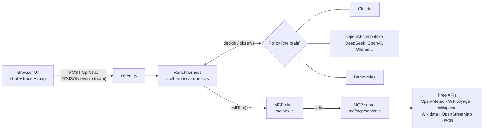

# 🧭 Wanderly - AI Travel Agent

Tell it *"3 days in Kyoto"* and watch it reason step by step, call real travel APIs through an **MCP server**, and build a day-by-day itinerary with a live map, weather, top sights and places to eat.

- **ReAct architecture**: the agent loops *Thought → Action → Observation* until it can give a *Final Answer*, and the UI shows every step live.
- **MCP tool server**: six travel tools behind the [Model Context Protocol](https://modelcontextprotocol.io). The web app uses them over MCP, and so can Claude Desktop or Claude Code.
- **Pluggable brain**: Claude, DeepSeek, OpenAI, Groq, OpenRouter, a local Ollama… Add a model from the UI by typing its API key, or run the no-key **Demo** policy.
- **Production-style harness**: step limits, per-tool timeouts, retries with backoff, cancellation, caching, output truncation, JSONL traces, unit tests and an eval suite.
- **Free data, no keys**: Open-Meteo, Wikivoyage/Wikipedia, Wikidata, OpenStreetMap and ECB exchange rates.

---

## Quick start

Requires **Node.js 22.9+**.

```bash
git clone https://github.com/axlezhao/Wanderly-AI-Travel-Agent.git
cd Wanderly-AI-Travel-Agent
npm install
npm start
```

Open **http://localhost:3000**. With no API key it runs in **Demo** mode: a rule-based policy that uses the same harness and tools.

To use a real LLM, either:

- **In the UI:** click **⚙ Models** → pick a preset (DeepSeek, Anthropic, OpenAI…) → paste your API key → **Discover models** → **Test connection** → **Save model**.
- **Or in `.env`:** `cp .env.example .env` and fill in `ANTHROPIC_API_KEY` and/or `DEEPSEEK_API_KEY`, then restart.

Keys stay on your computer (`.env` and `models.local.json` are git-ignored) and are never sent to the browser.

---

## How it works



### ReAct in one paragraph

**ReAct** (*Reason + Act*) is an agent pattern. Instead of answering in one shot, the model alternates between **Thought** ("I need Kyoto's coordinates first"), **Action** (call `search_destination`), and **Observation** (the tool's result), repeating until it has enough to write the **Answer**. Independent actions in one step run in parallel. In this app:

| ReAct | Claude | OpenAI-compatible | UI |
|---|---|---|---|
| Thought | text before `tool_use` blocks | `content` next to `tool_calls` | "THOUGHT" line |
| Action | `tool_use` blocks | `tool_calls` | tool row with spinner |
| Observation | `tool_result` blocks | `role: "tool"` messages | ✅ + summary |
| Answer | response with no tool calls | message with no tool calls | the itinerary |

### The harness

The model only decides *what to do next*. [`src/harness/harness.js`](src/harness/harness.js) owns everything around it, and gives every policy the same guarantees:

| Guarantee | Why |
|---|---|
| **Step limit** (`MAX_STEPS`, default 8), last step forces an answer | no infinite loops; you always get *something* |
| **Parallel actions** within a step | weather + sights + restaurants at once |
| **Per-tool timeout** (60 s) and **retries with backoff** for transient errors (429, 5xx, timeouts) | free public APIs are flaky |
| **Real cancellation**: Stop button → HTTP request → harness → MCP `cancelled` → `fetch` aborted | no zombie requests hogging rate limits |
| **Caching**: per-session in the harness, 15 min shared in the MCP server | fewer API calls, instant repeats |
| **Observation truncation** (12k chars) | one huge result can't flood the context |
| **Errors become observations** | the model sees "not found" and changes approach |
| **Structured events + JSONL traces** in `traces/` | watch it live, debug it later |

A policy is anything with `decide()` and `observe()`, so adding a new brain doesn't touch the harness.

### The MCP server

[`src/mcp/server.js`](src/mcp/server.js) exposes six read-only tools (zod-validated inputs) plus a `plan_trip` prompt:

| Tool | Data source |
|---|---|
| `search_destination` | Open-Meteo Geocoding |
| `get_travel_guide` | Wikivoyage (falls back to Wikipedia) |
| `get_weather` | Open-Meteo forecast (≤16 days) or archive (last year's weather on the same dates) |
| `find_attractions` | OpenStreetMap sights with a Wikidata entry, ranked by Wikipedia page views |
| `find_places` | OpenStreetMap via Overpass: restaurants, cafés, bars, hotels, museums, parks… |
| `get_exchange_rate` | Frankfurter (European Central Bank rates) |

**Use it from Claude Code:** this repo includes `.mcp.json`, so running `claude` in the project folder offers the `travel-tools` server.

**Use it from Claude Desktop:** add this to `claude_desktop_config.json` (use your absolute path):

```json
{
  "mcpServers": {
    "travel-tools": {
      "command": "node",
      "args": ["/absolute/path/to/Wanderly-AI-Travel-Agent/src/mcp/server.js"]
    }
  }
}
```

**Poke at it by hand:** `npx @modelcontextprotocol/inspector node src/mcp/server.js`

---

## Models

| Where | How |
|---|---|
| UI | **⚙ Models** → preset → API key → **Discover models** lists what your key can access → **Test connection** → **Save** |
| `.env` | `ANTHROPIC_API_KEY` (+ `CLAUDE_MODEL`), `DEEPSEEK_API_KEY` (+ `DEEPSEEK_MODELS`), or `OPENAI_API_KEY` + `OPENAI_MODEL` + `OPENAI_BASE_URL` |

Two provider types cover almost everything:

- **`anthropic`**: Claude via the official `@anthropic-ai/sdk`, with adaptive thinking, prompt caching and server-side refusal fallback on Opus 5.
- **`openai-compatible`**: any `/chat/completions` API with tool calling: DeepSeek (`https://api.deepseek.com`), OpenAI, Groq, OpenRouter, Together, Mistral, or local Ollama/LM Studio (`http://localhost:11434/v1`, no key).

To add a new kind of provider, write a policy class in `src/policies/` with `addUserMessage`, `decide` and `observe`, and register it in `src/models/registry.js`.

---

## Tests and evals

```bash
npm test                                   # 17 offline tests: harness guarantees, MCP contract, policies
npm run eval                               # live end-to-end scenarios with the default model
npm run eval -- --model demo               # a specific model (ids: npm run eval -- --list)
npm run eval -- --only kyoto,lisbon-food   # a subset
```

`npm test` needs no network or keys. It uses a fake toolbox, scripted policies, and a mock OpenAI-style server that streams fragmented tool calls.

`npm run eval` runs real trip requests through the full stack and scores them with automatic checks: *looked up the destination first*, *names ≥3 real sights returned by the tools* (a grounding check against hallucinated places), *used last year's weather for far-off dates*, *admits when a place doesn't exist*, *≤ 6 steps*. Results are saved to `evals/results/` so you can compare models or prompt changes.

---

## Project layout

```
server.js                     web server: sessions, streaming, model endpoints
public/                       UI (vanilla JS + Leaflet map, no build step)
src/
  harness/
    harness.js                the ReAct loop and its guarantees
    toolbox.js                MCP client (spawns + talks to the MCP server)
    tracer.js                 JSONL traces → traces/
    labels.js                 human-readable action/observation labels
  mcp/server.js               MCP server exposing the travel tools
  tools/travel-apis.js        the free-API implementations
  policies/
    claude.js                 Claude (Anthropic SDK)
    openai-compatible.js      DeepSeek / OpenAI / Groq / Ollama …
    demo.js                   rule-based policy, no LLM
    prompt.js                 shared ReAct system prompt
  models/registry.js          model list, presets, discovery, connection test
test/                         node:test unit tests
scripts/eval.js               end-to-end eval suite
```

## Limits

- No flight or hotel prices or booking: there's no free, keyless API for that. The agent says so.
- The Overpass (OpenStreetMap) server is shared and sometimes slow. The harness retries and the agent adapts, but a lookup can occasionally take 10–20 s.
- Sessions live in memory; restarting the server clears conversations.
